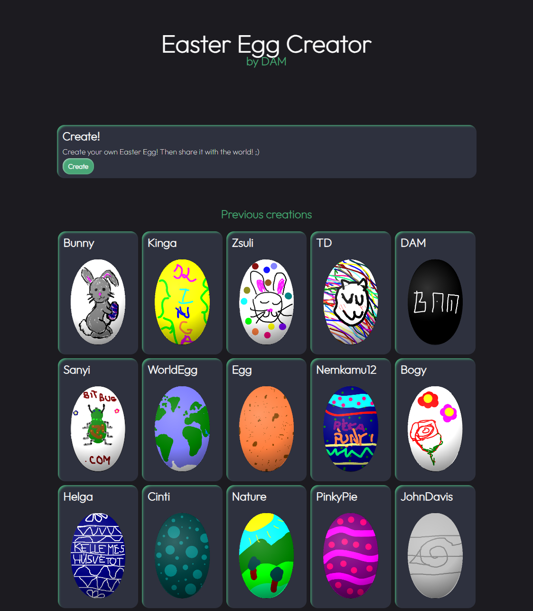
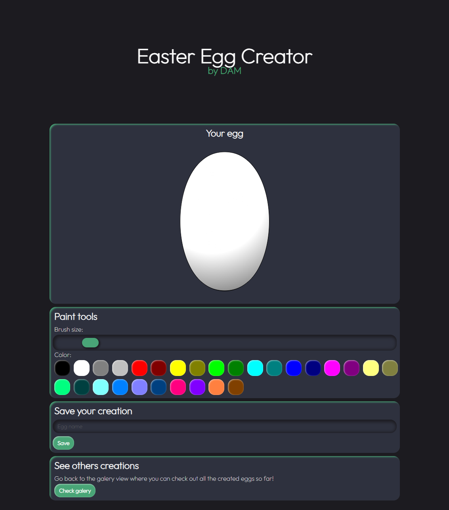

# Easter Egg Drawing App
Made with: ```HTML```, ```CSS```, ```JS```

Check it out https://www.damdev.xyz/Content/easterEggCreator/

## Welcome to the Easter Egg Drawing App! 🐰🥚🎨

This funky little tool lets you unleash your creativity by decorating Easter eggs in your own unique style. Choose from a variety of colors and designs to make your egg stand out from the crowd.

Once you've crafted your masterpiece, hit save, and voilà! Your egg will be immortalized on our server for everyone to admire. And don't forget to check out what other artists have created for some egg-citing inspiration!

## Features:


- Decorate your own Easter egg with a range of colors and designs.
- Save your creations and share them with others.
- Browse through a gallery of eggs created by fellow artists for inspiration.

## How to Use:


- Choose a color or pattern from the palette.
- Use your mouse or touchscreen to draw on the egg.
- Click the save button to save your egg to the server.
- Explore the gallery to see other eggs and get inspired.
- Let's make this Easter egg-ceptional! 🐣✨